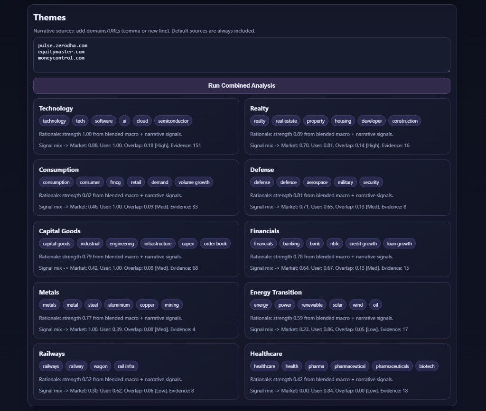
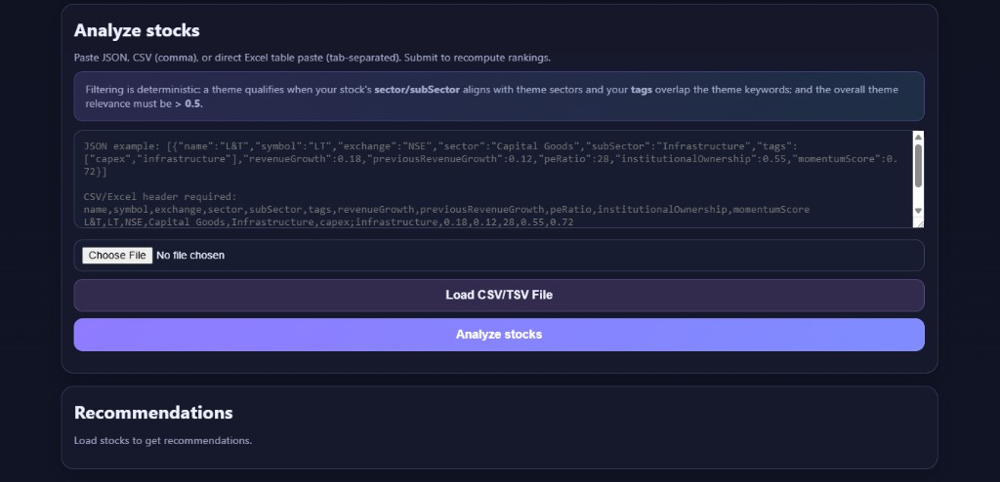
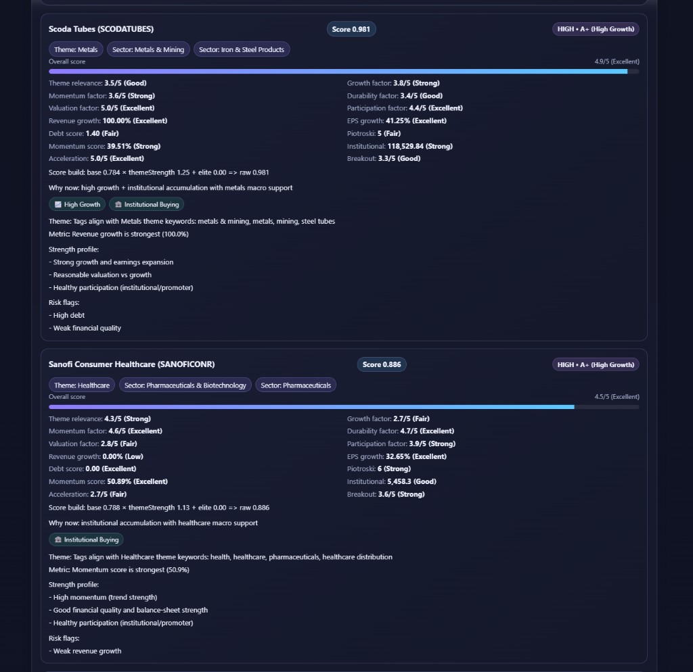

# Sentinel — Macro-driven stock discovery (India)

<p align="center">
  
</p>

**Sentinel** maps **macro themes** to **high-growth Indian stocks** using deterministic scoring and a **financial interpretation layer** (growth, earnings, debt, quality—not raw numbers only).

It answers: **“What stocks are positioned to benefit from what is happening right now?”**

**Pipeline:** narrative + market signals → themes → match stocks by sector/subsector + keywords → score and rank → explainable cards in the UI.

---

## Product preview

### Themes (market + narrative)

Themes blend **market trend** text (indices / configured sources) with **your narrative sources** (domains or exact URLs). Each card shows strength, tags, and **signal mix** (market vs user narrative, overlap band, evidence count).



### Analyze stocks

Paste JSON, CSV/TSV, or an Excel table, or **Load CSV/TSV File**. Loading a file **replaces** the in-memory universe. **Analyze stocks** submits to the API and refreshes themes and recommendations.



### Recommendations

Ranked **stock cards**: conviction/tier, theme and sector chips, factor breakdown (1–5-style bands), raw inputs where available, and **why now** rationale.



---

## Why Sentinel

| Typical tools | Sentinel |
|---------------|----------|
| “What looks good on a screen?” | “What fits **today’s** macro themes?” |
| Opaque ranks | Deterministic rules + visible breakdowns |

---

## Core features

- Dynamic themes from Indian finance sources (optional Tavily/OpenAI; fallbacks if keys are missing)
- Theme ↔ stock matching: sector / subSector + keyword overlap; relevance thresholding
- **Financial interpretation layer:** classifies revenue/EPS growth, debt risk, Piotroski, momentum, institutional activity
- Composite scoring: growth, momentum, participation, valuation, acceleration
- Web UI: paste or upload screener-style data

### Financial interpretation layer

Rules turn metrics into signals (e.g. weak / good / excellent growth, balance-sheet risk, quality). That is how Sentinel **reasons** about names, not only sums columns.

---

## Tech stack

| Area | Stack |
|------|--------|
| Backend | Node.js, Express 5, TypeScript, Zod |
| Integrations | Optional Tavily (search), OpenAI (enrichment / polish) |
| Frontend | Static `webapp/` (HTML/CSS/JS), served by the backend |

**API:** `GET /health`, `GET /trends` · `GET /themes`, `GET /recommendations`, `POST /stocks` (JSON or `csv` text with `replace: true` to overwrite the universe).

---

## Quick start

**Needs:** Node.js 18+ and npm.

```bash
git clone https://github.com/somthebuilder/Sentinel_Finance.git
cd Sentinel_Finance/backend
npm install
cp .env.example .env
# Edit .env — at minimum set TAVILY_API_KEY for richer themes; OPENAI_* optional
npm run dev
```

Open **http://localhost:3000** (or your `PORT`). Production-style: `npm run build && npm run start`.

### Use the app

1. **Themes** — Adjust narrative sources; **Run Combined Analysis** refreshes themes and recommendations. Read **signal mix** to see market vs your sources and overlap.
2. **Analyze stocks** — Paste or upload; **Analyze stocks** runs ingest + scoring. Watch status under **Recommendations** for progress.
3. **Recommendations** — If empty, check the parse report and that sectors/tags overlap active themes.

**Data:** Works best with **Trendlyne-style** exports; other screeners may need interpreter tweaks (see disclaimer).

---

## Typical stock fields

`name`, `symbol`, `exchange`, `sector`, `subSector`, `tags`, plus growth/valuation/ownership fields the parser can map (e.g. `revenueGrowth`, `peRatio`, `institutionalOwnership`, `momentumScore`). Aliasing handles many CSV header variants.

---

## Roadmap (summary)

- **Now:** Sharper theme ↔ stock mapping, sector-specific interpretation rules, tagging and breakout-style signals  
- **Next:** Validation (hit rates, history), execution hints (timing, risk), product features (watchlists, multi-user)

---

## Disclaimer

Not financial advice. Do your own diligence.

Sentinel is tuned for **Trendlyne-style** dumps; verify the financial interpretation layer for other data vendors before relying on scores.
